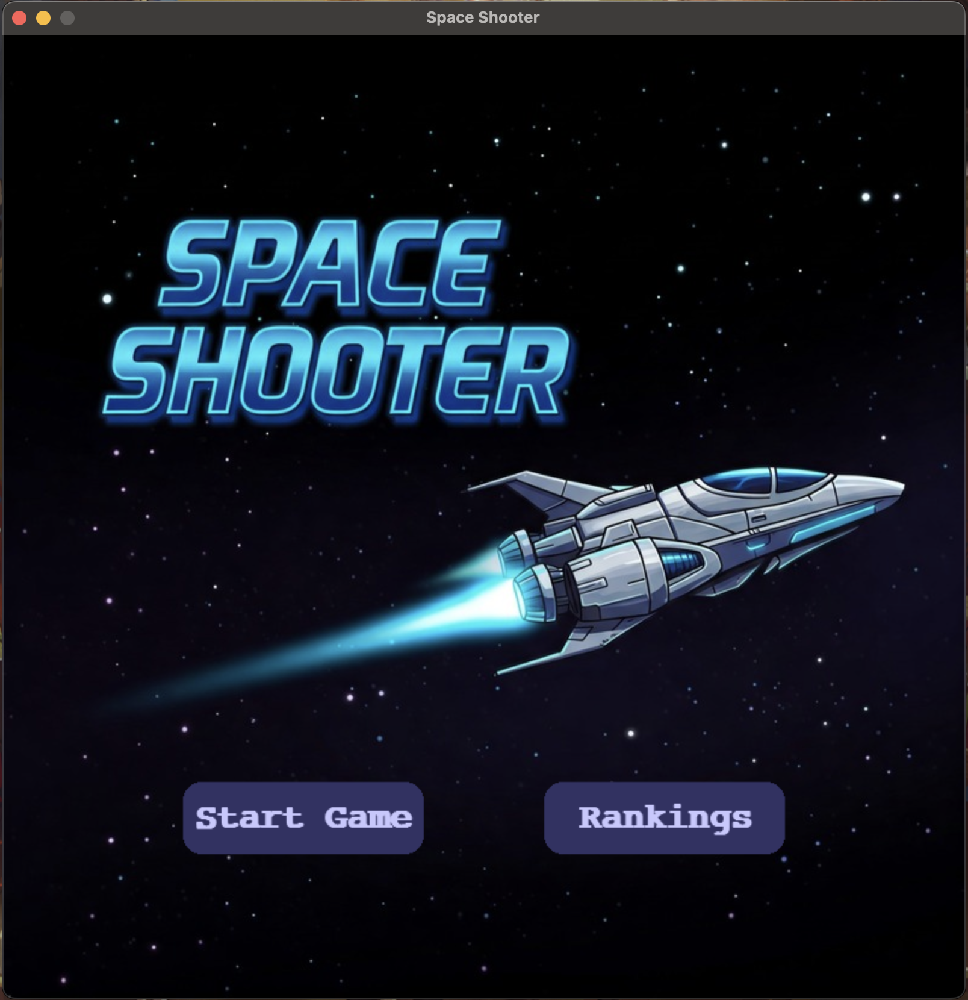
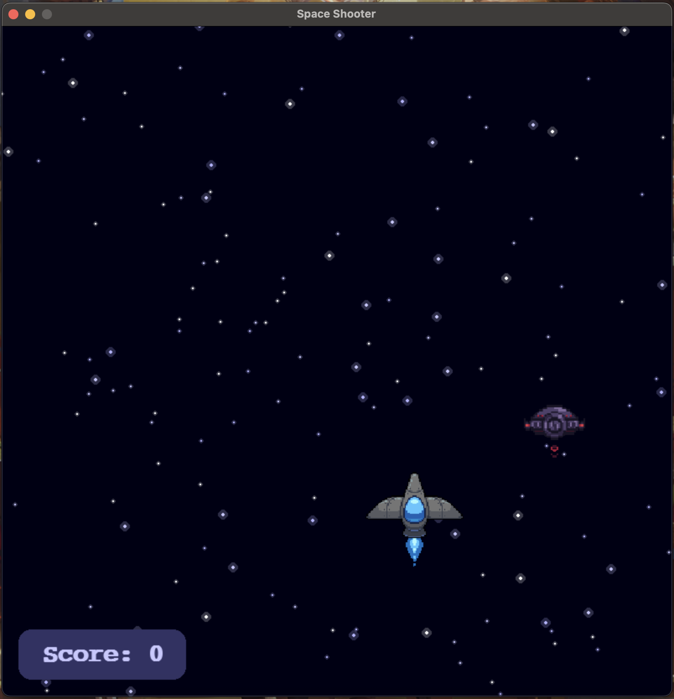
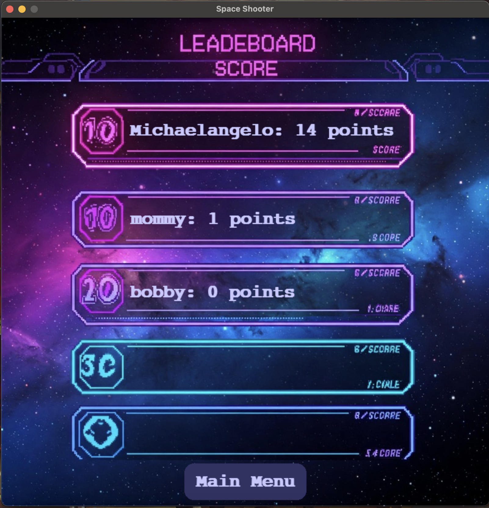
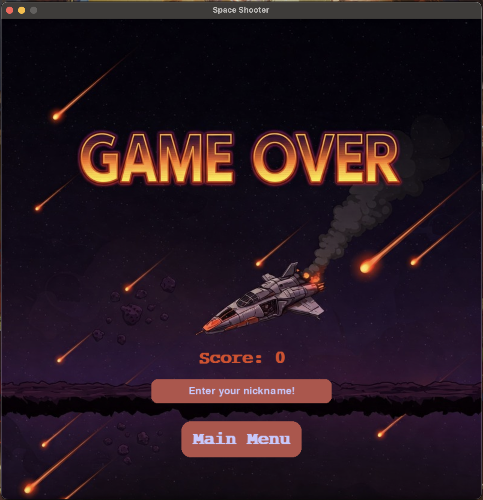

# 🚀 Space Shooter: A Python-Powered Space Shooter Game (😅)

**Space Shooter** is a 2D arcade-style game built using Python and Pygame. I created this as a personal project to 
challenge myself and apply concepts from my first-year Computer Science courses at Dalhousie University.

It was a fun and practical way to put my object-oriented programming (OOP) and software design skills to the test—while 
also having a blast (pun intended).

Players control a spaceship, fire energy blasts, battle waves of aliens, and climb the leaderboard by surviving as long 
as possible.

---

## 🧠 What I Learned

This game was inspired by my desire to turn first-year Computer Science knowledge into something interactive and fun.
Below are some of the key concepts I applied, along with the courses where I first encountered them:

- Modular architecture and clean code structure: ***CSCI 1110***
- Python OOP (classes, aggregation, dependencies): ***CSCI 1110***
- Use of game states, and flags: ***CSCI 1120***
- Animation with sprite frames: ***CSCI 1105***
- UI design (game over screen, name input, leaderboard): ***CSCI 1170***
- Requesting and Sending Data via HTTPS requests: ***CSCI 1170***
- Sound and effects handling
- Real-time collision detection

While the courses alone didn’t teach me everything, they were eye-openers that laid a solid foundation and gave me the 
confidence to build this project.

---

## 🎮 Game Features

- 🛸 Mouse-controlled spaceship with smooth animations  
- 🔫 Energy blasts with firing cooldowns  
- 👾 Dynamic alien waves that scale with your score  
- 💥 Explosion effects and sound effects  
- 🎵 Background music and real-time sound FX  
- 🧍 Name input and score tracking  
- 🏆 Leaderboard system to record top players  
- ⌛ Countdown between alien waves to allow breathing room

---

## 📸 Demo

Here's a quick look at some of the features:

<div align="center">
<!-- Gameplay GIF -->


<!-- Screenshots side by side -->
<p>
  
  
</p>
<p>
  
  
</p>
</div>

---

## 🛠️ Requirements

- Python 3.8+  
- [Pygame](https://www.pygame.org/) (`pip install pygame`)
- [Requests](https://pypi.org/project/requests/) (`pip install requests`)

View requirements.txt file for full list

---

## 🚀 Getting Started

1. **Clone this repository**
    ```bash
       git clone https://github.com/Its-Kirito/space-shooter.git
       cd space-shooter
    ```   

2. **Install Pygame and other dependencies**
    ```bash
       pip install -r requirements.txt
    ```   

3. **Run the game**
   ```bash
       python main.py
    ```   

4. **Break things and let me know what went wrong🥲**

*__NB:__ The game makes HTTPS requests when you submit a name or view the leaderboard, so there may be a short delay. 
Please be patient!*

---

## 📝 Credits
This project uses third-party assets for educational and non-commercial purposes:

- Player, Explosion, and Alien sprites: Found via Google Image search (public domain or free-use sources)
- Background Images: Generated using [Google's Gemini AI (2.5 Pro)](https://gemini.google.com/app)
- Music and sound effects: Sourced from [Pixabay](https://pixabay.com/).

Full credits (names/links) are listed in CREDITS.md.

---

## 🙌 Acknowledgments
To my professors, friends, and the online communities that kept me motivated—thank you!
